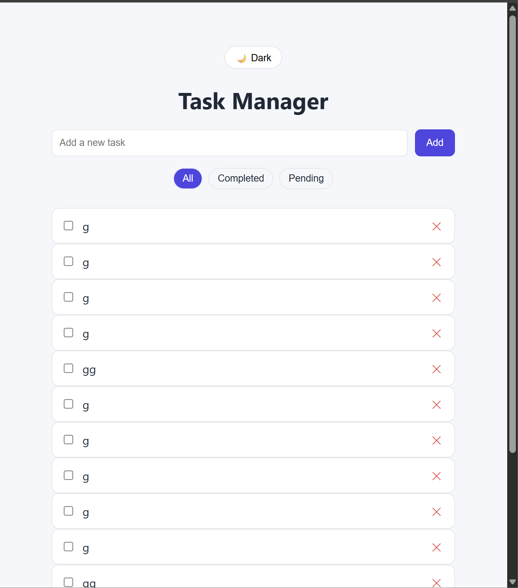
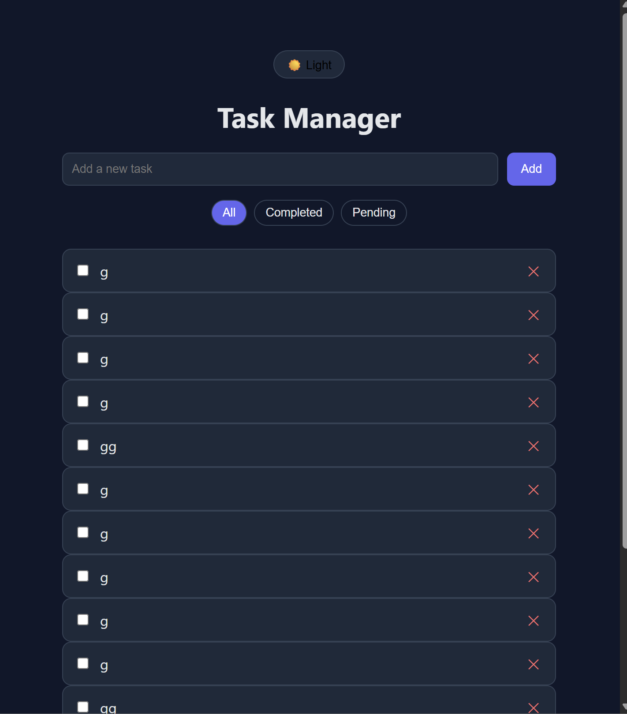

# 📝 Task Manager App

A modern, responsive **Task Manager** built with **React** that supports task creation, completion tracking, filtering, drag-and-drop reordering, persistent theming, and local storage–based data persistence.

---

## 🚀 Features

- ✅ Add, complete, and delete tasks
- 🔍 Filter tasks by **All / Completed / Pending**
- 🔀 Drag & Drop task reordering (enabled in *All* view)
- 🌗 Light / Dark theme toggle with persistence
- 💾 Tasks and theme saved in `localStorage`
- 📱 Fully responsive UI
- ⚡ Built using modern React patterns

---

## 🛠 Tech Stack

- React 18
- Vite
- Context API
- @hello-pangea/dnd
- CSS Variables
- Custom Hooks

---

## 🧠 Architecture Overview

src/
│
├── components/
│   ├── TaskForm.jsx
│   ├── TaskList.jsx
│   ├── TaskItem.jsx
│   ├── FilterBar.jsx
│   └── ThemeToggle.jsx
│
├── context/
│   └── TaskContext.jsx
│
├── hooks/
│   └── useLocalStorage.js
│
├── styles/
│   └── theme.css
│
├── App.jsx
├── main.jsx

---

## 📦 State Management

- Context API is used to manage tasks globally.
- A custom `useLocalStorage` hook ensures tasks and theme persist across page reloads.
- Derived state is memoized using `useMemo` for better performance.

---

## 🔀 Drag & Drop Behavior

- Drag & Drop is enabled **only in the “All” view**.
- Filtered views (`Completed`, `Pending`) display derived task lists.
- Restricting reordering to the All view avoids data inconsistency and preserves task integrity.

---

## 🌗 Theme System

- Implemented using CSS variables
- Theme is applied using a `data-theme` attribute on the `<html>` element
- User preference is persisted in localStorage

---

## 🎯 Design Decisions

1. **Context API over Redux**: For this app's scope, Context API provides sufficient state management without additional dependencies

2. **Drag & Drop in "All" View Only**: Prevents data inconsistencies when reordering filtered subsets of tasks

3. **CSS Variables for Theming**: Enables dynamic theme switching without CSS-in-JS overhead

4. **localStorage for Persistence**: Simple, effective solution for client-side data persistence without backend requirements

5. **Component Composition**: Small, focused components for better maintainability and reusability

---
## 🖼 Screenshots

*Add screenshots here*



## ▶️ Getting Started

### Clone the repository
```bash
git clone https://github.com/9A-Ayush/limetray-task-manager.git
cd limetray-task-manager
```

### Install dependencies
```bash
npm install
```

### Run the development server
```bash
npm run dev
```

The app will be available at `http://localhost:5173`

### Build for production
```bash
npm run build
```

### Preview production build
```bash
npm preview
```
## 🧪 Testing

This project uses Vitest and React Testing Library for unit and integration tests.

```bash
npm run test

## 👤 Author

**Ayush**

- GitHub: [@9A-Ayush](https://github.com/9A-Ayush)
- Project Link: [https://github.com/9A-Ayush/limetray-task-manager](https://github.com/9A-Ayush/limetray-task-manager)

## 📄 License

This project is open source and available under the [MIT License](LICENSE).

---

Made with ❤️ by Ayush
